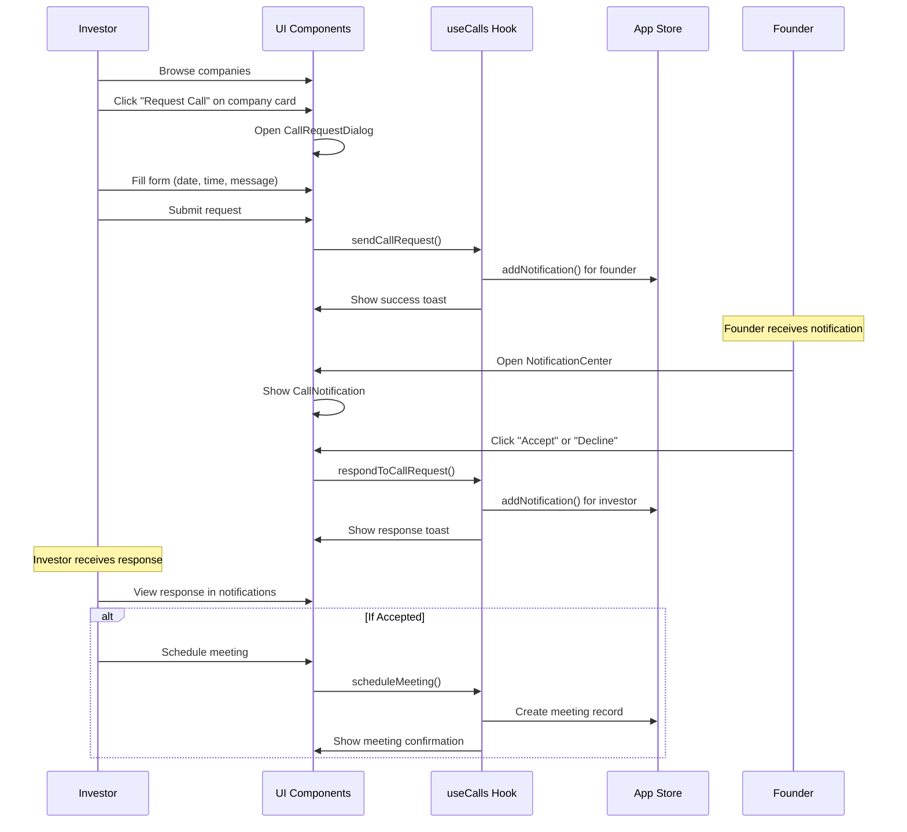
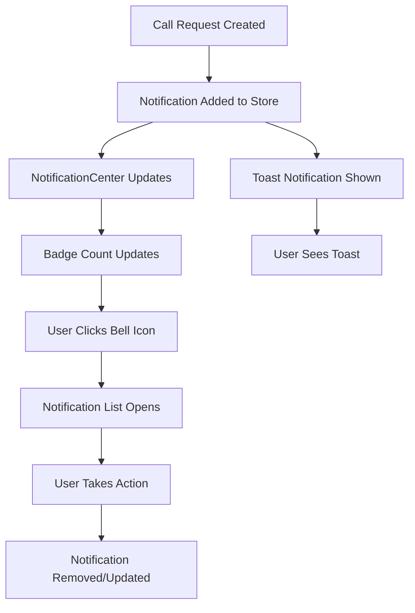

# Call Scheduling and Notification System Integration

## Overview

The call scheduling and notification system has been fully integrated into the Liora platform, providing a complete workflow for investors and founders to connect and schedule meetings. This document outlines the integration points and workflows.

## Integration Points

### 1. Dashboard Layout Integration

**File:** `liora/src/components/layout/dashboard-layout.tsx`

- **NotificationCenter** integrated in the top navigation bar
- Replaces the static bell icon with an interactive notification center
- Shows unread notification count with badge
- Handles call acceptance/decline directly from notifications

**Changes:**
- Added NotificationCenter component import
- Added useCalls hook for call response handling
- Replaced static Bell button with NotificationCenter component

### 2. Investor Workflow Integration

#### Company Discovery (`liora/src/components/investor/company-card.tsx`)
- **"Request Call" button** added to each company card
- **CallRequestDialog** integration for scheduling call requests
- **Real-time call request submission** with toast notifications

**Features:**
- One-click call request from company cards
- Date and time selection interface
- Optional message to founders
- Form validation and submission feedback

#### Investor Dashboard (`liora/src/app/investor/page.tsx`)
- **Call metrics** in dashboard stats cards
- **Call management section** showing recent requests and meetings
- **Toast notifications** for real-time updates
- **Navigation to dedicated calls page**

#### Dedicated Calls Page (`liora/src/app/investor/calls/page.tsx`)
- **Complete call workflow management**
- **Statistics dashboard** (pending, accepted, scheduled, completed)
- **CallWorkflow component** for managing all call-related activities
- **Real-time status updates**

### 3. Founder Workflow Integration

#### Founder Dashboard (`liora/src/app/founder/page.tsx`)
- **Call request metrics** replacing investor views
- **Toast notifications** for incoming call requests
- **Call request count** with pending status indicator

#### Dedicated Calls Page (`liora/src/app/founder/calls/page.tsx`)
- **Call request management** with accept/decline functionality
- **Meeting scheduling** interface
- **Investor information** display
- **Priority alerts** for pending requests

### 4. Navigation Integration

**File:** `liora/src/components/layout/dashboard-layout.tsx`

**Founder Navigation:**
- Dashboard → `/founder`
- Company Profile → `/founder/profile`
- **Investor Calls** → `/founder/calls` (NEW)
- AI Interview → `/founder/interview`
- Settings → `/founder/settings`

**Investor Navigation:**
- Dashboard → `/investor`
- Discover Companies → `/investor/companies`
- **Call Management** → `/investor/calls` (NEW)
- My Preferences → `/investor/preferences`
- Saved Companies → `/investor/saved`

## Complete Workflows

### 1. Investor-to-Founder Call Request Flow

### 2. Real-time Notification Flow

## Key Components

### Core Components
1. **CallRequestDialog** - Modal for requesting calls
2. **CallNotification** - Display and respond to call requests
3. **NotificationCenter** - Centralized notification management
4. **CallWorkflow** - Complete call lifecycle management
5. **CallToastNotifications** - Real-time toast notifications

### State Management
- **useCalls Hook** - Manages all call-related state and operations
- **useAppStore** - Handles notifications and user data
- **Mock Data Integration** - Provides realistic demo data

### Pages
- `/investor/calls` - Investor call management dashboard
- `/founder/calls` - Founder call request management
- `/calls/demo` - Interactive demo of all features

## Features Implemented

### ✅ Investor Features
- Browse companies with call request buttons
- Send call requests with scheduling preferences
- Receive real-time notifications for responses
- Manage call workflow from request to meeting
- View call statistics and metrics
- Schedule meetings after call acceptance

### ✅ Founder Features
- Receive call request notifications
- Accept or decline requests with messages
- View investor information and request details
- Schedule meetings with accepted requests
- Manage multiple concurrent call requests
- Priority alerts for pending requests

### ✅ Real-time Features
- Toast notifications for all call events
- Notification center with unread badges
- Real-time status updates
- Automatic notification management

### ✅ UI/UX Features
- Consistent shadcn/ui component usage
- Responsive design for all screen sizes
- Accessibility compliance
- Loading states and error handling
- Form validation and feedback

## Mock Data

The system includes comprehensive mock data for demonstration:

- **3 sample call requests** with different statuses
- **2 scheduled meetings** with realistic timing
- **3 call notifications** showing different types
- **3 investor profiles** with portfolio information

## Testing

The integration has been tested for:
- TypeScript compilation without errors
- Component rendering and interactions
- State management and data flow
- Navigation and routing
- Real-time notification updates

## Future Enhancements

### Potential Improvements
1. **Video Call Integration** - Direct integration with Zoom/Google Meet
2. **Calendar Sync** - Integration with external calendars
3. **Email Notifications** - Backup notifications via email
4. **Meeting Reminders** - Automated reminder system
5. **Call Recording** - Meeting recording and transcription
6. **Analytics Dashboard** - Detailed call metrics and insights

### Technical Improvements
1. **WebSocket Integration** - Real-time updates via WebSocket
2. **Push Notifications** - Browser push notifications
3. **Offline Support** - Offline call request queuing
4. **Performance Optimization** - Virtual scrolling for large lists
5. **Advanced Filtering** - Complex call filtering and search

## Deployment Notes

### Environment Setup
- All components use existing shadcn/ui setup
- No additional dependencies required beyond date-fns and sonner
- Compatible with existing authentication and routing

### Configuration
- Mock data can be replaced with API calls
- Notification system integrates with existing store
- Toast notifications use existing Sonner setup

## Conclusion

The call scheduling and notification system is fully integrated into the Liora platform, providing a seamless experience for both investors and founders. The system handles the complete workflow from initial call requests to scheduled meetings, with real-time notifications and comprehensive management interfaces.

The integration maintains consistency with the existing design system and architecture while adding powerful new functionality that enhances the core value proposition of connecting investors and founders.